# yudao-boot-mini - 芋道源码精简版

> 基于 Spring Boot 2.7 + MyBatis Plus 的快速开发平台

## 项目愿景

yudao-boot-mini 是芋道源码（ruoyi-vue-pro）的精简版本，提供企业级后台管理系统的核心功能，包括用户管理、权限控制、基础设施等，适用于快速搭建中小型后台管理系统。

## 架构总览

- **技术栈**: Java 8 + Spring Boot 2.7.18 + MyBatis Plus 3.5.15
- **数据库**: 支持 MySQL、PostgreSQL、Oracle、SQL Server、达梦、人大金仓、OpenGauss
- **缓存**: Redis + Redisson 3.52.0
- **安全**: Spring Security 5.8.16 + OAuth2
- **API 文档**: SpringDoc 1.8.0 + Knife4j 4.5.0
- **代码生成**: Velocity 2.4 模板引擎

## 模块结构图

```mermaid
graph TD
    A["yudao-boot-mini"] --> B["yudao-dependencies"]
    A --> C["yudao-framework"]
    A --> D["yudao-server"]
    A --> E["yudao-module-system"]
    A --> F["yudao-module-infra"]

    C --> C1["yudao-common"]
    C --> C2["yudao-spring-boot-starter-mybatis"]
    C --> C3["yudao-spring-boot-starter-redis"]
    C --> C4["yudao-spring-boot-starter-web"]
    C --> C5["yudao-spring-boot-starter-security"]
    C --> C6["yudao-spring-boot-starter-websocket"]
    C --> C7["yudao-spring-boot-starter-monitor"]
    C --> C8["yudao-spring-boot-starter-protection"]
    C --> C9["yudao-spring-boot-starter-job"]
    C --> C10["yudao-spring-boot-starter-mq"]
    C --> C11["yudao-spring-boot-starter-excel"]
    C --> C12["yudao-spring-boot-starter-biz-tenant"]
    C --> C13["yudao-spring-boot-starter-biz-data-permission"]
    C --> C14["yudao-spring-boot-starter-biz-ip"]

    click B "./yudao-dependencies/CLAUDE.md" "查看依赖管理模块"
    click C "./yudao-framework/CLAUDE.md" "查看框架模块"
    click D "./yudao-server/CLAUDE.md" "查看启动模块"
    click E "./yudao-module-system/CLAUDE.md" "查看系统模块"
    click F "./yudao-module-infra/CLAUDE.md" "查看基础设施模块"
```



## 模块索引

| 模块路径 | 职责描述 | 语言 | 入口文件 | Controller | Service |
|---------|---------|------|---------|------------|---------|
| yudao-dependencies | 依赖版本管理 BOM | XML | pom.xml | - | - |
| yudao-framework | 技术组件框架层 (14个子模块) | Java | pom.xml | - | - |
| yudao-server | 主启动项目（容器） | Java | YudaoServerApplication.java | 1 | - |
| yudao-module-system | 系统核心功能模块 | Java | pom.xml | 47 | 38 |
| yudao-module-infra | 基础设施模块 | Java | pom.xml | 16 | 19 |

## 运行与开发

### 环境要求
- JDK 8+
- Maven 3.6+
- MySQL 5.7+ / PostgreSQL 10+ / Oracle / SQL Server / 达梦 / 人大金仓 / OpenGauss
- Redis 5.0+

### 快速启动

```bash
# 1. 初始化数据库
# MySQL: 执行 sql/mysql/ruoyi-vue-pro.sql 和 sql/mysql/quartz.sql
# PostgreSQL: 执行 sql/postgresql/ruoyi-vue-pro.sql 和 sql/postgresql/quartz.sql
# 其他数据库参考 sql/ 目录下对应文件夹

# 2. 修改配置
# 编辑 yudao-server/src/main/resources/application-local.yaml

# 3. 启动项目
mvn spring-boot:run -pl yudao-server

# 或打包后运行
mvn package -pl yudao-server
java -jar yudao-server/target/yudao-server.jar
```

### 主要配置文件
- `yudao-server/src/main/resources/application.yaml` - 主配置
- `yudao-server/src/main/resources/application-local.yaml` - 本地开发配置
- `yudao-server/src/main/resources/application-dev.yaml` - 开发环境配置

### API 文档
- Swagger UI: http://localhost:48080/swagger-ui
- Knife4j: http://localhost:48080/doc.html

### 数据库脚本位置
| 数据库 | SQL 文件路径 |
|-------|-------------|
| MySQL | sql/mysql/ |
| PostgreSQL | sql/postgresql/ |
| Oracle | sql/oracle/ |
| SQL Server | sql/sqlserver/ |
| 达梦 | sql/dm/ |
| 人大金仓 | sql/kingbase/ |
| OpenGauss | sql/opengauss/ |

## 测试策略

- 测试框架: JUnit 5 + Spring Boot Test
- 测试文件位置: `yudao-server/src/test/java`
- 数据模拟: Podam 7.2.11 (随机数据生成)
- Redis Mock: Jedis Mock 1.1.12
- Mockito: mockito-inline 4.11.0

## 编码规范

### 代码结构
```
module/
  ├── api/           # 模块间 API 接口
  ├── controller/    # REST 控制器
  │   ├── admin/     # 后台管理接口
  │   ├── app/       # 移动端接口
  │   └── vo/        # 视图对象
  ├── service/       # 业务逻辑层
  ├── dal/           # 数据访问层
  │   ├── dataobject/  # 数据对象
  │   └── mysql/       # Mapper 接口
  ├── convert/       # 对象转换器 (MapStruct)
  ├── enums/         # 枚举定义
  ├── framework/     # 模块框架配置
  └── job/           # 定时任务
```

### 命名规范
- Controller: `XxxController`
- Service: `XxxService` / `XxxServiceImpl`
- Mapper: `XxxMapper`
- DO: `XxxDO` (数据对象)
- VO: `XxxReqVO` / `XxxRespVO` (请求/响应对象)
- DTO: `XxxDTO` (数据传输对象)

### 注解使用
- `@Operation` - Swagger 接口描述
- `@PreAuthorize` - 权限校验
- `@TenantIgnore` - 忽略多租户
- `@DataPermission` - 数据权限控制

## AI 使用指引

### 常用任务
1. **新增 CRUD 功能**: 使用代码生成器 (`/admin-api/infra/codegen`)
2. **新增 API 接口**: 在对应模块的 controller 目录创建
3. **修改权限配置**: 查看 `yudao.security` 配置
4. **添加定时任务**: 参考 yudao-spring-boot-starter-job

### 关键路径
- 认证登录: `yudao-module-system/src/main/java/cn/iocoder/yudao/module/system/controller/admin/auth/AuthController.java`
- 用户管理: `yudao-module-system/src/main/java/cn/iocoder/yudao/module/system/service/user/AdminUserService.java`
- 权限控制: `yudao-module-system/src/main/java/cn/iocoder/yudao/module/system/service/permission/PermissionService.java`
- 代码生成: `yudao-module-infra/src/main/java/cn/iocoder/yudao/module/infra/service/codegen/CodegenService.java`
- 文件上传: `yudao-module-infra/src/main/java/cn/iocoder/yudao/module/infra/service/file/FileService.java`

### 数据库表前缀
- `system_` - 系统模块表
- `infra_` - 基础设施模块表

### 扫描包路径
- 启动扫描包: `cn.iocoder.yudao.server`, `cn.iocoder.yudao.module`
- 类型别名包: `cn.iocoder.yudao.module.*.dal.dataobject`

## 变更记录 (Changelog)

### 2026-01-28
- 更新项目扫描文档
- 完善模块统计信息（Controller: 64, Service: 122）
- 添加数据库脚本位置说明
- 更新依赖版本信息

### 2026-01-23
- 初始化项目 AI 上下文文档
- 生成根级和模块级 CLAUDE.md

---
*文档更新时间: 2026-01-28*
